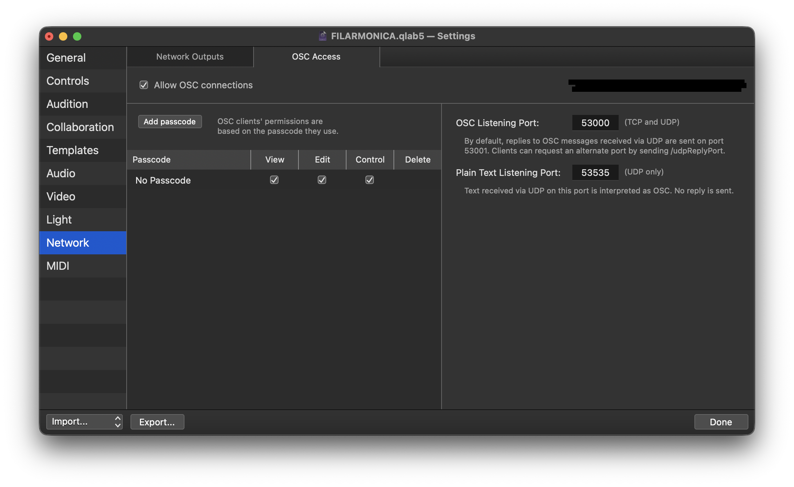
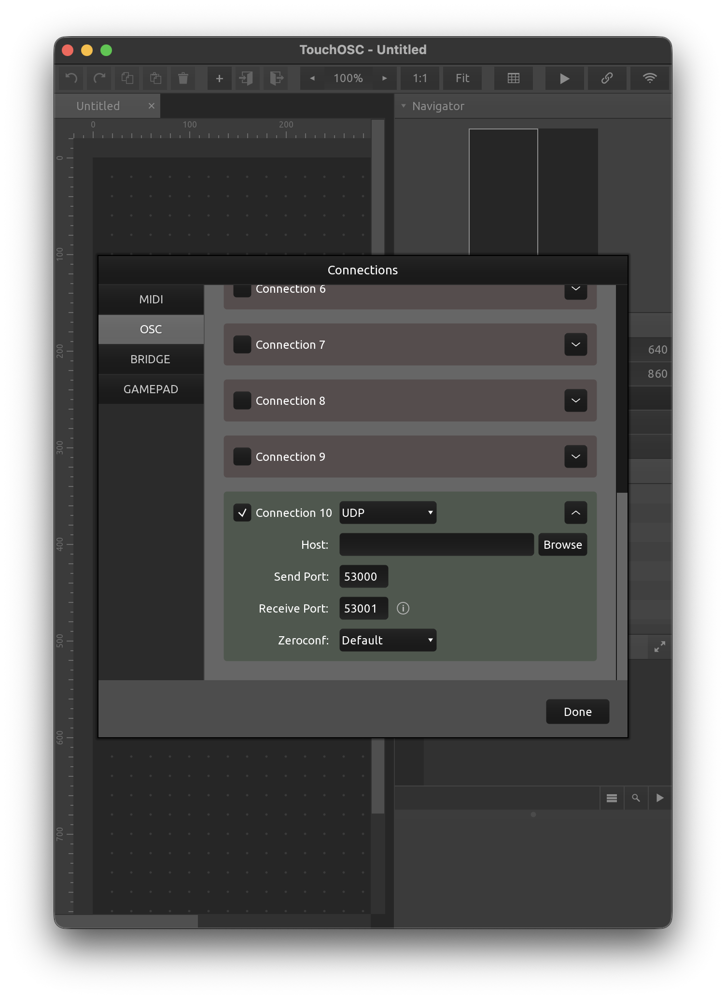

# Qlab-TouchOSC-Layouts

TouchOSC remote-control layouts for QLab 5, adapted for an iPad and a phone. Both provide OSC control and live feedback for a QLab workspace.

- [iPad layout](layouts/ipad/Qlab_iPad_V3.5.tosc)
- [Mobile layout](layouts/mobile/Qlab_Phone_V3.5.tosc) (iPhone and Android)

## Use

1. Open the appropriate `.tosc` file in TouchOSC on your device.
2. Put the device and the QLab Mac on the same network. In QLab, enable OSC access for the workspace and allow the required control permissions.
3. In TouchOSC, point the layout's OSC output to the QLab Mac on UDP port `53000`; set the TouchOSC OSC input port to `53001` for replies. Adjust the ports in both apps if your QLab setup differs.
4. Open the workspace, select a Cue List or Cue Cart, and use the Control, Cue List, and Buttons pages.

QLab OSC Access (the IP address is hidden in this example):

TouchOSC OSC Connection 10 (enter your QLab Mac's IP address in **Host**):

The QLab example grants View, Edit, and Control without a passcode. Anyone who can reach that OSC port can use those permissions; use this setting only on a trusted network.

## Features and changes from the original

- Playhead and running-cue feedback, with cue number/name and active-cue status.
- Dynamic Cue List and Cue Cart selection, plus cue browsing with group expansion and pagination (60 Cue List rows and 32 Buttons per page).
- Buttons launch cues by stable QLab cue ID; cue selection and the selected cue's timing, level, and other controls stay linked across pages.
- Shallow OSC queries for lists and cue children reduce oversized UDP replies; both layouts keep the original remote controls and adapt the screen layout to their devices.

## Acknowledgements / Credits

Based on the [original QLab TouchOSC layout by ziginfo (ZigSon)](https://github.com/ziginfo/TouchOSC-Layouts/tree/main/QLab), including its design and Lua scripts. Version 3.5 was adapted and expanded by Rodrigo Filarmónica in 2026. The original project's [MIT license](https://github.com/ziginfo/TouchOSC-Layouts/blob/main/LICENSE) and copyright notice are preserved in [LICENSE](LICENSE) and in the layout metadata.
